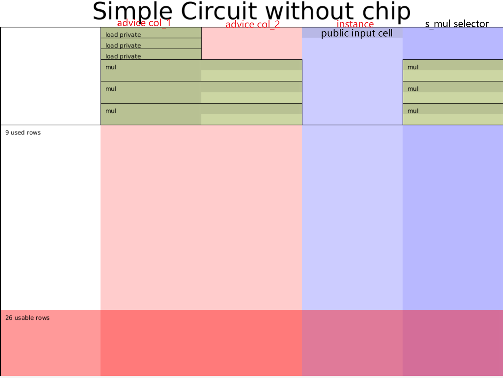

## Overview
考虑如下电路:
```
private inputs: a,b
public inputs: out
constrains:
a^2 * b^2 *const = out
```
从电路的角度,只使用乘法门和乘法选择器，上述约束可以算数化为:

 | ins   | a0    | a1    | s_mul |
 |-------|-------|-------|-------|
 | *out* |    a  |       |       |
 |       |    b  |       |       |
 |       | const |       |       |
 |       |   ab  |   b   |   1   |
 |       |   ab  |       |   0   |
 |       |   ab  |   ab  |   1   |
 |       | absq  |       |   0   |
 |       |  absq | const |   1   |
 |       | *out* |       |   0   |

我们的目的则是利用Halo2定义好上述约束(gate/equality constrains)，同时上述表格填好(即指定witness)。
使用Halo2编写电路，需要为起实现`halo2_proofs::plonk::Circuit`的三个Trait:
- without_witnesses:创建默认无需witness的Circuit实例
- configure: 需要自定义:
    1. 电路配置: 有几列advice(即witness，包含private inputs和trace),instance(public inputs)和电路选择器selector
    2. gate约束
- synthesize:需要根据上述表格实现填充witness的逻辑，自定义每一个Cell的数据.
    1.填充以Region为基本单位(多行+多列构成的矩形)，可以在region中以相对引用的方式引用其他Row
    2.有两种填充方式: copy_advice(还会产生equality约束)+assign_advice(不会产生约束，约束在configure中给定)

一旦定义好上述3个Trait, Halo2便可以在电路实例化后**自动运行**(不需要手动触发上述函数)上述逻辑来填充witness和生成proof。

## 创建电路和Config

> 完整代码见[simple](../src/simple/simple.rs)

电路有需要两个Private inputs: `a`,`b`和常数`const`;同时需要两列witness(advice)，一列instance(填入公共输出out),和乘法门选择器(s_mul)。
```
#[derive(Debug, Clone)]
struct CircuitConfig {
    advice: [Column<Advice>;2],
    instance: Column<Instance>,
    s_mul: Selector,
}

#[derive(Default)]
struct MyCircuit<F:Field> {
    constant: F,
    a: Value<F>,
    b: Value<F>
}
```

## 实现前两个trait
```
impl <F:Field> Circuit<F> for MyCircuit<F> {
  fn without_witnesses(&self) -> Self {
        Self::default()
    }

    fn configure(meta: &mut ConstraintSystem<F>) -> Self::Config {
        let advice = [meta.advice_column(),meta.advice_column()];
        let instance = meta.instance_column();
        let constant = meta.fixed_column();

        meta.enable_equality(instance);
        meta.enable_constant(constant);
        for c in &advice {
            meta.enable_equality(*c);
        }
        let s_mul = meta.selector();
        /* Gate design:
            | a0 | a1 | s_mul|
            |----|----|------|
            |lhs |rhs |s_mul |
            |out |    |      |  
        */
        meta.create_gate("mul_gate", |meta| {
            let lhs = meta.query_advice(advice[0], Rotation::cur());
            let rhs = meta.query_advice(advice[1], Rotation::cur());
            let out = meta.query_advice(advice[0], Rotation::next());
            let s_mul = meta.query_selector(s_mul);
            vec![s_mul * (lhs*rhs - out)]
        });

        CircuitConfig {
            advice,
            instance,
            s_mul
        }
    }
}
```
需要注意的是Halo2中为了优化需要通过enable_equality明确指定哪些列设置equality约束，由于要保证gate对任意的witness都满足，所以只能通过query_advice来获取门的输入和输出，并设置约束(等式为0)。

## 实现witness填充

按照表格,一步步填充witness：
1. load private inputs `a`,`b`和constant
2. 分别计算三个乘法门，并填充Cell
3. 约束out那个Cell和instance那一列的第一个cell相等
```
fn load_private<F:Field>( 
    config: &CircuitConfig,
    mut layouter: impl Layouter<F>,
    value: Value<F>) -> Result<Number<F>, Error> {
    layouter.assign_region(
        || "load private", 
    |mut region| {
        region.assign_advice(
            || "private input", 
            config.advice[0], 
            0, 
            || value
        ).map(Number)
    })
}

fn load_constant<F:Field>( 
    config: &CircuitConfig,
    mut layouter: impl Layouter<F>,
    constant: F
) -> Result<Number<F>, Error> {
    layouter.assign_region(
        || "load private", 
    |mut region| {
        region.assign_advice_from_constant(
            || "private input", 
            config.advice[0], 
            0, 
            constant
        ).map(Number)
    })
}

fn mul<F:Field>(
    config: &CircuitConfig,
    mut layouter: impl Layouter<F>,
    a: Number<F>,
    b: Number<F>,
) -> Result<Number<F>, Error> {
    layouter.assign_region(
        || "mul", 
    |mut region| {
        config.s_mul.enable(&mut region, 0)?;
        a.0.copy_advice(|| "lhs", &mut region, config.advice[0], 0)?;
        b.0.copy_advice(|| "rhs", &mut region, config.advice[1], 0)?;

        let value = a.0.value().copied() * b.0.value().copied();
        region.assign_advice(|| "out=lhs*rhs", config.advice[0], 1, || value)
        .map(Number)
    })
}

impl <F:Field> Circuit<F> for MyCircuit<F> {
    //...
    fn synthesize(&self, config: Self::Config, mut layouter: impl Layouter<F>) -> Result<(), Error> {
        let a = load_private(&config,layouter.namespace(|| "load a"), self.a)?;
        let b = load_private(&config,layouter.namespace(|| "load b"), self.b)?;
        let constant = load_constant(&config,layouter.namespace(|| "load constant"), self.constant)?;


        let ab = mul(&config,layouter.namespace(|| "a*b"), a, b)?;
        let absq = mul(&config,layouter.namespace(|| "ab*ab"), ab.clone(), ab)?;
        let c = mul(&config, layouter.namespace(|| "absq*constant"), absq, constant)?;

        //expose public
        layouter.namespace(|| "expose c").constrain_instance(c.0.cell(), config.instance, 0)
    }
}
```

## Mock prove

最后实例化电路，并调用相应的Mock Prover来验证:

```
#[cfg(test)]
mod tests {
    use halo2_proofs::{dev::MockProver, pasta::Fp};
    use super::*;
    #[test]
    fn test_simple() {
        // ANCHOR: test-circuit
        // The number of rows in our circuit cannot exceed 2^k. Since our example
        // circuit is very small, we can pick a very small value here.
        let k = 5;
    
        // Prepare the private and public inputs to the circuit!
        let constant = Fp::from(2);
        let a = Fp::from(2);
        let b = Fp::from(3);
        let c = constant * a.square() * b.square();
        println!("c=:{:?}",c);
    
        // Instantiate the circuit with the private inputs.
        let circuit = MyCircuit {
            constant,
            a: Value::known(a),
            b: Value::known(b),
        };
    
        // Arrange the public input. We expose the multiplication result in row 0
        // of the instance column, so we position it there in our public inputs.
        let mut public_inputs = vec![c];
    
        // Given the correct public input, our circuit will verify.
        let prover = MockProver::run(k, &circuit, vec![public_inputs.clone()]).unwrap();
        assert_eq!(prover.verify(), Ok(()));
    
        // If we try some other public input, the proof will fail!
        public_inputs[0] += Fp::one();
        let prover = MockProver::run(k, &circuit, vec![public_inputs]).unwrap();
        assert!(prover.verify().is_err());
        println!("simple success!")
        // ANCHOR_END: test-circuit
    }
}
```

同时，还可以利用Halo2的tool输出电路的整个结构便于是否欠约束(under constrain):
```

    #[cfg(feature = "dev-graph")]
    #[test]
    fn plot_circuit(){
        // Instantiate the circuit with the private inputs.
        let circuit = MyCircuit::<Fp>::default();
        // Create the area you want to draw on.
        // Use SVGBackend if you want to render to .svg instead.
        use plotters::prelude::*;
        let root = BitMapBackend::new("layout.png", (1024, 768)).into_drawing_area();
        root.fill(&WHITE).unwrap();
        let root = root
            .titled("Simple Circuit without chip", ("sans-serif", 60))
            .unwrap();

        halo2_proofs::dev::CircuitLayout::default()
            // You can optionally render only a section of the circuit.
            // .view_width(0..2)
            // .view_height(0..16)
            // You can hide labels, which can be useful with smaller areas.
            .show_labels(true)
            // Render the circuit onto your area!
            // The first argument is the size parameter for the circuit.
            .render(5, &circuit, &root)
            .unwrap();
    }
```

运行`cargo test plot_circuit  --features dev-graph`，可以输出电路结构图。

从下图可以看出，整个电路一共9行4列，与表格设计一致。
