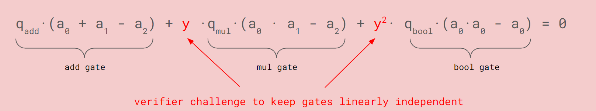
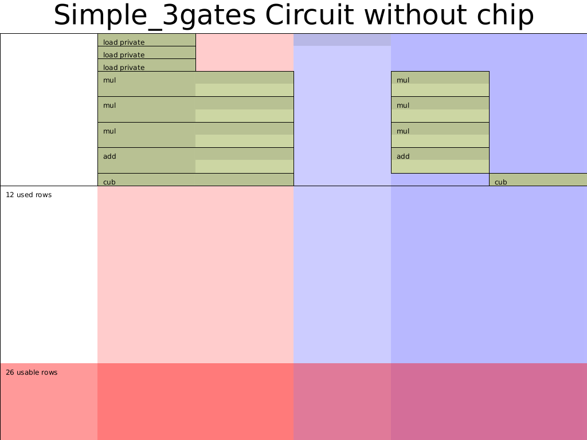

## Custom gates and Chip
在上一节中，我们使用Halo2的APi实现了基本的gate，但是如果有多种gate呢，这种情况如何处理?
在Halo2中可通过自定义门(custom gates)来实现，这里需要回顾下Halo2中自定义门的mental model:
$$
q_{add}*(a_0 + a_1 - a_2) + q_{mul}*(a_0*a_1 - a_2) + q_{bool}*(a_0*a_0 - a_0) = 0
$$
如上式，自定义门可以由任意多种不同的门线性相加构成，每一个门由选择器和门运算逻辑构成，如上式中第一个加法门选择器为$q_{add}$，电路逻辑为$a_2=a_0 + a_1$。不过需要注意的是，Halo2中需要为每个门调用`create_gate`，看起来这些门之间是独立的，但实际上这些门在最终的电路约束检查中会通过一个随机数`y`，一次行检查一行的witness是否满足**所有门**的约束。


## 问题定义
本节则是证明如下电路:
```
private inputs: a,b
public inputs: out
a^2 * b^2 = c
d = c + const
out = d^3
```

采用加法门、乘法门和三次方来解决上述问题。首先画出电路表格:
| ins   | a0    | a1    | s_mul | s_add | s_cub |
|-------|-------|-------|-------|-------|-------|
|  out  |    a  |       |       |       |       |
|       |    b  |       |       |       |       |
|       | const |       |       |       |       |
|       |   ab  |   b   |   1   |   0   |   0   |
|       |   ab  |       |   0   |   0   |   0   |
|       |   ab  |   ab  |   1   |   0   |   0   |
|       | absq  |       |   0   |   0   |   0   |
|       |  absq | const |   1   |   0   |   0   |
|       |  c    |       |   0   |   0   |   0   |
|       |  c    | const |   0   |   1   |   0   |
|       |  d    |       |   0   |   0   |   0   |
|       |  d    |  out  |   0   |   0   |   1   |

> 完整代码见[simple](../src/simple/simple_3gates.rs)
### Config

我们需要明确电路所需的Advices,Selectors和Instance列，并创建相应的门。
```
#[derive(Debug, Clone)]
struct CircuitConfig {
    advice: [Column<Advice>;2],
    instance: Column<Instance>,
    s_mul: Selector,
    s_add: Selector,
    s_cub: Selector,
}

impl <F:Field> Circuit<F> for MyCircuit<F> {
    type Config = CircuitConfig;
    type FloorPlanner = SimpleFloorPlanner;

    fn without_witnesses(&self) -> Self {
        Self::default()
    }

    fn configure(meta: &mut ConstraintSystem<F>) -> Self::Config {
        let advice = [meta.advice_column(),meta.advice_column()];
        let instance = meta.instance_column();
        let constant = meta.fixed_column();

        meta.enable_equality(instance);
        meta.enable_constant(constant);
        for c in &advice {
            meta.enable_equality(*c);
        }
        let s_mul = meta.selector();
        let s_add = meta.selector();
        let s_cub = meta.selector();

        meta.create_gate("mul_gate", |meta| {
            let lhs = meta.query_advice(advice[0], Rotation::cur());
            let rhs = meta.query_advice(advice[1], Rotation::cur());
            let out = meta.query_advice(advice[0], Rotation::next());
            let s_mul = meta.query_selector(s_mul);
            Constraints::with_selector(s_mul, vec![(lhs * rhs - out)])
        });

        meta.create_gate("add_gate", |meta| {
            let lhs = meta.query_advice(advice[0], Rotation::cur());
            let rhs = meta.query_advice(advice[1], Rotation::cur());
            let out = meta.query_advice(advice[0], Rotation::next());
            let s_add = meta.query_selector(s_add);
            Constraints::with_selector(s_add, vec![(lhs + rhs - out)])
        });

        meta.create_gate("cub_gate", |meta| {
            let lhs = meta.query_advice(advice[0], Rotation::cur());
            let out = meta.query_advice(advice[1], Rotation::cur());
            let s_cub = meta.query_selector(s_cub);
            Constraints::with_selector(s_cub, vec![(lhs.clone()*lhs.clone()*lhs - out)])
        });

        CircuitConfig {
            advice,
            instance,
            s_mul,
            s_add,
            s_cub
        }
    }
    ...
}

```

### 填入Witness
除了上节的加法门和乘法门之外，我们需要为立方运算增加一个填witness的辅助函数:
```
...
fn cub<F:Field>(
    config: &CircuitConfig,
    mut layouter: impl Layouter<F>,
    a: Number<F>,
) -> Result<Number<F>, Error> {
    layouter.assign_region(
        || "cub", 
    |mut region| {
        config.s_cub.enable(&mut region, 0)?;
        a.0.copy_advice(|| "lhs", &mut region, config.advice[0], 0)?;
        let value = a.0.value().copied()*a.0.value().copied()*a.0.value().copied();
        region.assign_advice(|| "out=lhs^3", config.advice[1], 0, || value)
        .map(Number)
    })
}
...

```

然后补充Circuit Trait中的synthesis函数:
```
impl <F:Field> Circuit<F> for MyCircuit<F> {
    ...
    fn synthesize(&self, config: Self::Config, mut layouter: impl Layouter<F>) -> Result<(), Error> {
        let a = load_private(&config,layouter.namespace(|| "load a"), self.a)?;
        let b = load_private(&config,layouter.namespace(|| "load b"), self.b)?;
        let constant = load_constant(&config,layouter.namespace(|| "load constant"), self.constant)?;


        let ab = mul(&config,layouter.namespace(|| "a*b"), a, b)?;
        let absq = mul(&config,layouter.namespace(|| "ab*ab"), ab.clone(), ab)?;
        let c = mul(&config, layouter.namespace(|| "absq*constant"), absq, constant.clone())?;

        let d = add(&config, layouter.namespace(|| "absq + constant"), c, constant)?;
        let out = cub(&config, layouter.namespace(|| "absq^3"), d)?;

        //expose public
        layouter.namespace(|| "expose out").constrain_instance(out.0.cell(), config.instance, 0)
    }
}

```

### 测试
实例化电路，并调用相应的Mock Prover来验证。
```
cargo test test_simple_3gates
```
输出相应的电路布局图:

可以看出Halo2对乘法门选择器(`s_mul`)和加法门选择器(`s_add`)做了优化，将这两列合并为了1列。

## Chip
在上述实现中，我们填入witness的函数和Config是分离的，为了更好地复用这些代码，类似于集成电路由很多个Chip构成，Halo2一般将实现一系列特定约束的函数(config以及相应的提供witness的函数)抽象为Chip。

我们可以将第一节中的约束抽象为`FieldChip`,完整代码见[simple_chip](../src/simple/simple_chip.rs)